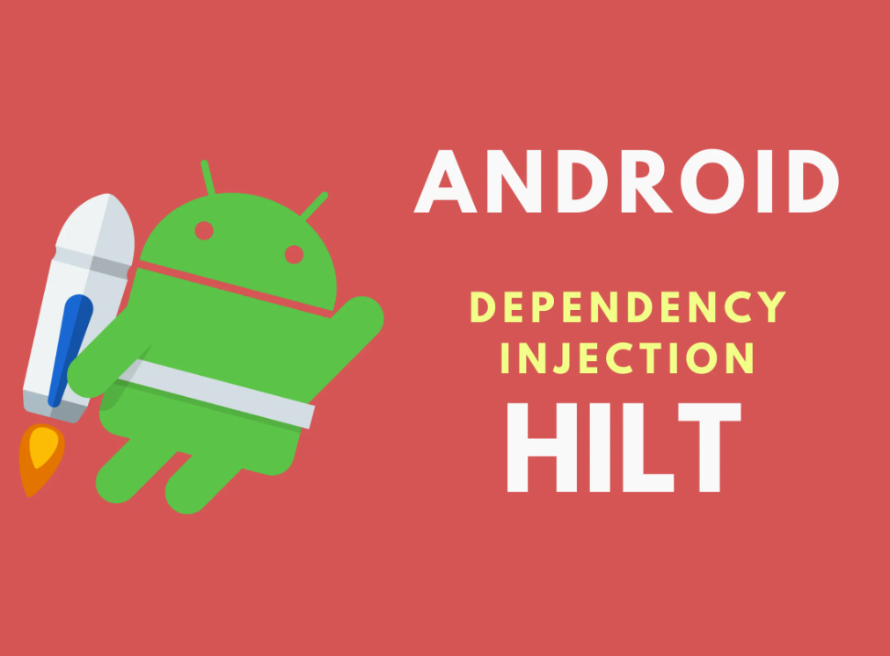

# Приложение для заказа еды:
Приложение с помощью которого ты можешь заказать свои любимые блюда.

<p  align="center">
<code></code>
</p>

## Стек используемых технологий

<p  align="left">
<code></code>
<code></code>
<code></code>
<code></code>
<code></code>
<code></code>
<code></code>
</p>

##  Описание работы приложения

После загрузки приложения мы видим экран где есть: 
Toolbar, BottomNavigationMenu, список категорий.
Для перехода к списку блюд тапаем на любое изображение категории.

<p align="center">
  <code> </code>
</p>

На экране Списка блюд, есть: теги, список еды, верхний Toolbar(содержит уже название группы блюд и 
кнопку для возврата на предыдущий экран.), BottomNavigationMenu. Чтобы  посмотреть 
определенный вид пищи, нужно тапнуть на него.

<p  align="center">
<code></code>
</p>

Если мы хотим добавить блюдо, то тапаем по кнопке ```Добавить в корзину```.

<p align="center">
  <code> </code>
</p>

Для работы с корзиной тапаем в BottomNavigationMenu на item ```Корзина```. Тут мы можем менять 
количество блюд. А если нажать минус, когда количество определенного блюда равно 1, то оно исчезнет
из списка. Также тут есть кнопка для оформления заказа.

<p align="center">
  <code>  </code>
</p>

## Описание проекта

`adapter` - тут классы адаптеры для работы с Recyclerview

`api` - тут классы адаптеры для работы с API

`app` - тут делаем свою реализацию Application для добавления библиотеки dagger2 хилтом

`di` - тут класcы для работы с зависимостями

`fragment` - тут класcы для работы c фрагментами

`fragment_actionbar` - тут класcы для работы c фрагментами, которые содержат actionbar, 
такие фрагменты можно подключить на определенные экраны, где нам нужен данный actionbar.

`fragment_popup` - тут класcы для работы c фрагментами содержащими pop_up. Подключаем, когда нужно
открыть подробную карточку блюда в pop_up.

`view` - тут класcы для работы c ViewModel. С помощью этих классов реализуем архитектуру MVVM и 
работаем с данными в потоках.